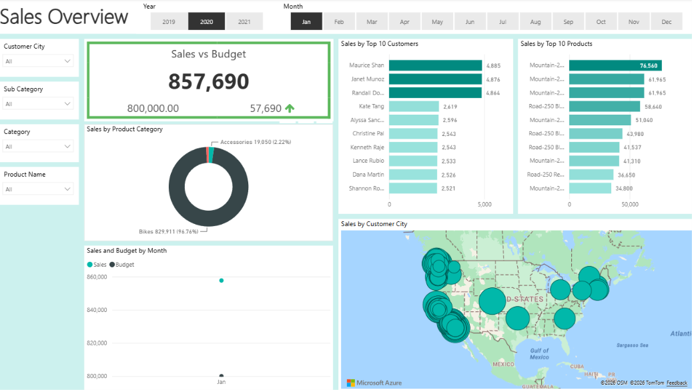

End-to-End Internet Sales Analytics Dashboard | Power BI + SQL

## 📊 Project Overview
This project analyzes internet sales data to provide business insights through an interactive Power BI dashboard.  
It follows a full BI workflow from business requirements to data modeling and visualization.

---

## 🎯 Business Objective
The goal of this project is to:
- Understand sales performance over time
- Identify top customers and products
- Analyze revenue trends
- Support data-driven decision making

---

## 🧱 Data Sources
The project includes the following datasets:
- Dim_Customers.csv
- Dim_Products.csv
- Dim_Calender.csv
- Fact_InternetSales.csv
- SalesBudget.xlsx

---

## 🧠 Project Workflow
1. Business Requirements Gathering  
2. Data Cleaning & Preparation  
3. Data Modeling (Star Schema)  
4. Data Analysis using SQL / Power BI  
5. Dashboard Development in Power BI  

---

## 📈 Dashboard Features
- Total Sales Overview
- Sales by Product
- Sales by Customer
- Monthly / Yearly Trends
- Budget vs Actual Comparison

---

## 🛠 Tools Used
- Power BI
- SQL Server (SSMS), Microsoft Power BI, Microsoft Excel
- Excel
- Git & GitHub

---

## 🗄️ SQL Data Preparation Layer

This project uses a structured SQL-based data preparation process to extract, clean, and transform data from the AdventureWorksDW database before loading it into Power BI.

The data was modeled using a **Star Schema approach**, separating the dataset into Fact and Dimension tables to optimize analytical performance and reporting efficiency.

---

## 📊 Data Model Structure

The following tables were prepared and transformed using SQL:

- **FactInternetSales** → Contains sales transaction-level data (orders, quantities, revenue, and dates)
- **DimProduct** → Product details including category, subcategory, attributes, and product status
- **DimCustomer** → Customer demographic and geographic information
- **DimDate** → Date dimension used for time-based analysis and reporting

---

## ⚙️ Key Transformations Applied

- Data filtering to focus on relevant analysis period
- Removal of unnecessary columns to optimize performance
- Joining related dimension tables (e.g., Product Category & Subcategory, Geography)
- Standardizing and cleaning attribute names for reporting consistency
- Creating analysis-ready datasets for Power BI modeling

---

## 🎯 Outcome

This SQL layer ensures that the dataset is clean, structured, and optimized for business intelligence analysis, enabling accurate insights and efficient dashboard performance in Power BI.

---

## 📌 Key Insights

- Identified top-performing products contributing to highest revenue
- Analyzed customer purchasing patterns across regions
- Tracked monthly sales trends and seasonal performance
- Compared sales performance against budget targets

---

## 📷 Dashboard Preview

---

## 👤 Author
Hussain Essa  
Information Systems Graduate  
